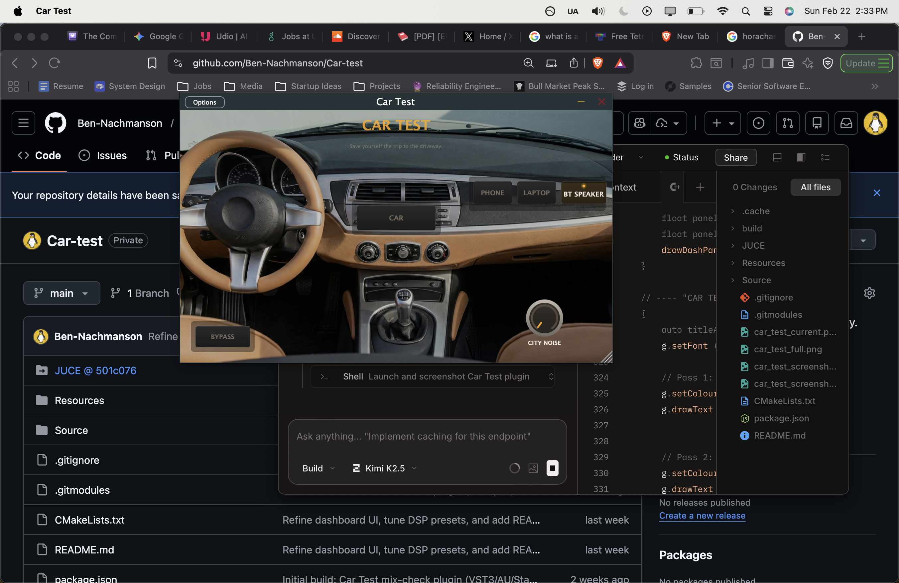

# Car Test

**Save yourself the trip to the driveway.**

Car Test is an audio plugin (VST3 / AU / Standalone) that simulates how your mix sounds on everyday playback systems — a car stereo, phone speaker, laptop, or Bluetooth speaker — so you can reference your music without leaving the studio.



## Why

Most music is consumed on cheap speakers in noisy environments. Studio monitors tell you what your mix *is*; Car Test tells you what your mix *does* when it hits the real world. Catching problems early — buried vocals on phone speakers, bass that disappears on laptops, or a low end that overwhelms in the car — saves revision cycles and leads to mixes that translate everywhere.

## Presets

| Preset | What it simulates | Key characteristics |
|---|---|---|
| **Bypass** | Flat / off | No processing. Use this as your A/B reference. |
| **Car** | Sedan car stereo | Cabin bass coupling, boxy low-mids, narrowed stereo image (60%), early reflections off windshield/dashboard/windows, convolution IR. |
| **Phone** | Phone speaker | Aggressive 300 Hz high-pass (no bass at all), harsh mid-range resonances, mono, convolution IR. |
| **Laptop** | Laptop speakers | 200 Hz high-pass, tinny resonance, narrow stereo (40%), convolution IR. |
| **BT Speaker** | Bluetooth speaker | DSP-style bass boost, mono, dynamics compression (-12 dB threshold, 4:1 ratio), convolution IR. |

## Audio Processing

Each preset runs your audio through a six-stage processing chain. Stages are enabled or bypassed per-preset.

```
Input -> IIR Filters -> Convolution IR -> Early Reflections -> Stereo Width -> Compressor -> Output Gain
```

### 1. IIR Filters (HP / LP / Parametric EQ)

The foundation of each preset's character. A high-pass filter removes bass below the speaker's physical capability, a low-pass rolls off the top end, and parametric peak EQ bands shape the resonances and colorations unique to each device.

- **Car:** HP @ 35 Hz, LP @ 16 kHz, gentle bass coupling at 80 Hz, boxy bump at 250 Hz, mild absorption dip at 2 kHz.
- **Phone:** HP @ 300 Hz, LP @ 15 kHz, presence emphasis at 1.5 kHz, harsh resonance at 3.5 kHz.
- **Laptop:** HP @ 200 Hz, LP @ 17 kHz, tinny resonance at 1 kHz, driver peak at 2.5 kHz.
- **BT Speaker:** HP @ 60 Hz, LP @ 17 kHz, +3 dB bass boost at 100 Hz (simulating onboard DSP), presence push at 3 kHz.

### 2. Convolution IR (Wet/Dry Blend)

Each preset loads a real impulse response captured from the corresponding speaker type. The IR is blended subtly (8-10% wet) with the EQ'd signal to add the physical resonance and coloration that filters alone can't replicate. The EQ does the heavy lifting; the IR adds realism.

### 3. Early Reflections (Car Preset Only)

A multi-tap delay network simulates sound bouncing off surfaces inside a car cabin:

| Surface | Delay | Gain |
|---|---|---|
| Windshield | 1.2 ms | 35% |
| Dashboard | 2.1 ms | 25% |
| Left side window | 3.0 ms | 18% |
| Right side window | 4.3 ms | 12% |
| Rear window | 5.5 ms | 8% |

The reflections are low-pass filtered at 6 kHz to simulate high-frequency absorption by soft cabin materials (seats, headliner). This is what gives the Car preset its characteristic enclosed, "listening from the driver's seat" quality.

### 4. Stereo Width (Mid-Side Processing)

Consumer speakers are physically close together or mono entirely. Mid-side encoding scales the side channel to narrow the stereo image:

- **Car:** 60% width (door speakers are close, but separated)
- **Laptop:** 40% width (tiny driver spacing)
- **Phone / BT Speaker:** Mono (single driver)

### 5. Compressor (BT Speaker Only)

Bluetooth speakers use onboard DSP compression to sound louder than their hardware should allow. Car Test replicates this with a compressor at -12 dB threshold and 4:1 ratio, with a 10 ms attack and 100 ms release.

### 6. Output Gain Trim

Compensates for perceived volume loss from bass removal so that level-matching between presets stays reasonable. The Phone preset gets the largest boost (+2 dB) since it loses the most low end.

## City Noise Generator

The rotary knob in the lower-right adds synthesized background noise to simulate listening in a noisy environment. The noise is a mix of three components:

- **Road rumble / traffic** — Filtered pink noise (Paul Kellet's approximation), low-passed at 400 Hz.
- **AC / engine hum** — Narrow-band noise centered around 120 Hz (band-passed between 80-180 Hz).
- **City ambience** — Mid-range texture, low-passed at 2 kHz.

The knob uses a quadratic taper so the first 50% of travel adds subtle ambience while the last 50% pushes into noticeable noise floor territory. This helps you judge whether vocals and lead elements cut through in a typical playback environment.

## Parameters

Car Test exposes two automatable parameters:

| Parameter | ID | Type | Range | Default |
|---|---|---|---|---|
| Environment | `preset` | Integer | 0-4 (Bypass, Car, Phone, Laptop, BT Speaker) | 0 |
| City Noise | `noiseAmount` | Float | 0.0 - 1.0 | 0.0 |

Both parameters are saved and recalled with your DAW session via JUCE's `AudioProcessorValueTreeState`.

## Building

### Requirements

- CMake 3.22+
- C++20 compatible compiler
- JUCE framework (included as a git submodule)

### Steps

```bash
git clone --recurse-submodules https://github.com/Ben-Nachmanson/Car-test.git
cd Car-test
cmake -B build -DCMAKE_BUILD_TYPE=Release
cmake --build build --target CarTest
```

Built plugins are output to `build/CarTest_artefacts/`:
- `AU/Car Test.component`
- `VST3/Car Test.vst3`
- `Standalone/Car Test.app`

With `COPY_PLUGIN_AFTER_BUILD` enabled, AU and VST3 formats are automatically installed to your system plugin directories.

## Project Structure

```
Car-test/
├── CMakeLists.txt                  # Build configuration
├── Source/
│   ├── PluginProcessor.h/cpp       # Audio engine, parameter layout, state save/recall
│   ├── PluginEditor.h/cpp          # GUI, custom LookAndFeel classes, color palette
│   └── DSP/
│       ├── EnvironmentProcessor.h/cpp   # Preset definitions + full DSP chain
│       └── NoiseGenerator.h/cpp         # City noise synthesis
├── Resources/
│   ├── Dashboard.png               # Background image
│   ├── sedan_ir.wav                # Car cabin impulse response
│   ├── phone_ir.wav                # Phone speaker impulse response
│   ├── laptop_ir.wav               # Laptop speaker impulse response
│   └── bt_speaker_ir.wav           # Bluetooth speaker impulse response
└── JUCE/                           # JUCE framework (git submodule)
```

## FAQ

**How should I use this in my mix workflow?**
Insert Car Test on your master bus (or a dedicated reference bus). Toggle between presets to spot-check how your mix translates. Common things to listen for: Does the vocal sit on Phone? Does the kick disappear on Laptop? Does the low end overwhelm on Car? Is the mix still balanced on BT Speaker with compression squashing dynamics?

**Does this replace actually checking on real speakers?**
No. This is a fast approximation for iterating during a session. It models the frequency response, stereo behavior, room characteristics, and dynamics of each device, but every real-world speaker has its own quirks. Use Car Test to catch the big problems early, then do a final check on actual devices when the mix is close.

**Why is the convolution IR mix so low (8-10%)?**
The IIR filters handle the main frequency shaping. The IRs add subtle physical resonance and cabinet coloring that EQ curves can't capture — things like cone breakup, enclosure resonance, and diffraction effects. Blending them in at low levels keeps the processing transparent and avoids the metallic artifacts that heavy convolution can introduce.

**Why does the Phone preset sound so harsh?**
Because phone speakers are harsh. The 300 Hz high-pass removes almost all bass, and the resonance peaks at 1.5 kHz and 3.5 kHz simulate the aggressive mid-range character of a tiny driver in a thin enclosure. If your mix sounds good on Phone, it'll sound good almost anywhere.

**Can I automate the preset switching?**
Yes. The `preset` parameter is exposed to your DAW's automation system. You can automate between environments during playback to quickly compare sections.

**What sample rates are supported?**
All filters and processing are sample-rate-aware. Car Test works at any sample rate your DAW supports (44.1 kHz, 48 kHz, 88.2 kHz, 96 kHz, etc.).

**Does it add latency?**
The convolution engine introduces a small amount of latency depending on your buffer size. In bypass mode, there is zero processing and zero latency.

**What is the City Noise knob for?**
It adds synthesized background noise (road rumble, AC hum, city ambience) to simulate real-world listening conditions. Many mix problems only become apparent when there's competing noise — a vocal that sounds clear in silence can get buried under traffic noise. Use it to check that your important elements cut through.

## License

MIT
